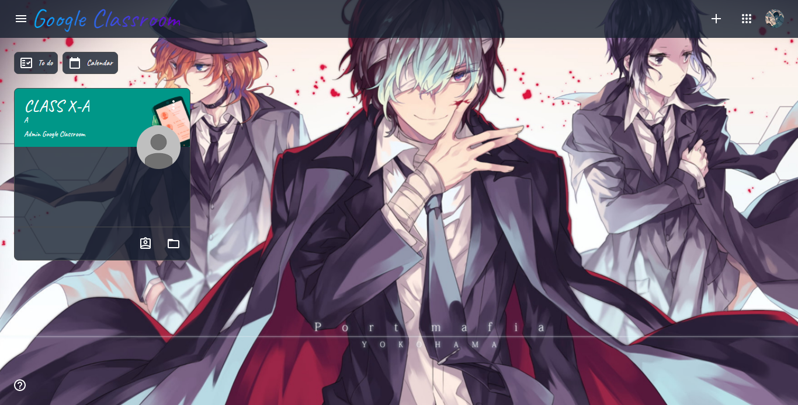
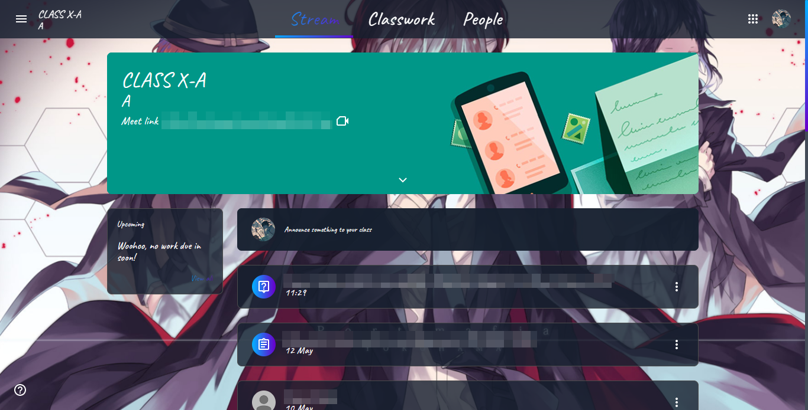

# GoogleClassroom-Moonlight Theme
___
### [Install directly with Violentmonkey/Tampermonkey](https://greasyfork.org/scripts/426414-google-classroom-moonlight/code/Google%20Classroom%20-%20Moonlight.user.js)
___

Bored of the old, monotonous crap look of Google Classroom. Spice up your life of online classes with [Moonlight theme](https://github.com/Risuleia/GoogleClassroom-Moonlight/). A custom theme for [Google Classroom](https://classroom.google.com/). It has got a semi-transparent, glossy look, along with awesome animations and more stuff.

## Installation
1. Install any Userscript manager.
	* [Violentmonkey for Chrome](https://chrome.google.com/webstore/detail/violent-monkey/jinjaccalgkegednnccohejagnlnfdag) or [Edge](https://microsoftedge.microsoft.com/addons/detail/eeagobfjdenkkddmbclomhiblgggliao)
	* [Tampermonkey for Chrome](https://chrome.google.com/webstore/detail/dhdgffkkebhmkfjojejmpbldmpobfkfo) or [Edge](https://microsoftedge.microsoft.com/addons/detail/tampermonkey/iikmkjmpaadaobahmlepeloendndfphd)
2. Install [Google Classroom - Moonlight.user.js](https://github.com/Risuleia/GoogleClassroom-Moonlight/raw/main/Google%20Classroom%20-%20Moonlight.user.js).

## Preview
Note: Some parts of the images have been blurred to respect privacy :)

